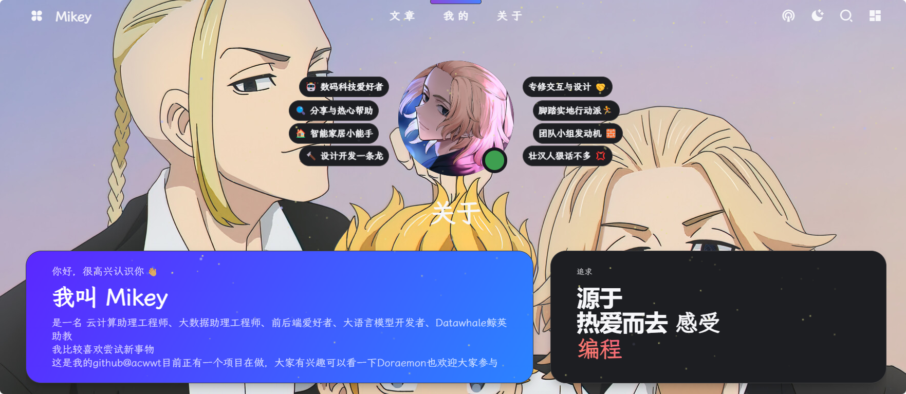

<h1 align="center">Hello Doraemon!</h1>
<h3 align="center">
<picture>
   
</picture>
</h3>

  
  
  

  <a href="https://github.com/acwwt/Doraemon/blob/main/README.md">简体中文</a>

## 简介

Doraemon 是一个多工具类的agent，目前正在开发阶段，项目的目标是在使用或者是微调大模型的时候能更加方便，现在的想法包括提取小说对话，将大模型嵌入到博客中，构建一个针对个人知识库的总结助手。

目前，Doraemon 主要包含以下功能：

### 1. 小说对话提取

具体内容可以看[extract](./extract/)，目前默认使用的是InternLM的api接口，因为在我测试过程中，发现InternLM提取对话的能力更好，大家可以给[InternLM](https://github.com/InternLM)点个star⭐。

后面可能会支持其他国产大模型的api，国外的不太方便所以就暂时不考虑了，不过现在项目主要还是使用InternLM的api。后续的话会将`dialogue_extractor`集成到lagent中，就是可以使用本地的InternLM模型进行对话提取。

下面是`dialogue_extractor`的web UI：
 

### 2. 大模型-文章总结

后续的话还会将大模型能力嵌入到博客中去，利用大语言模型进行文章的总结，这个灵感来源于Halo博客hao主题的一个功能-TianGPT，大家也可以关注一下我的博客[Mikey](https://blog.lingkongstudy.com.cn/about)，欢迎大家在博客里面评论交流。
 

前段时间也顺手做了两个小工具，一个是github信息统计，另一个是二维码拼接的，项目分别在[GitHub-Repository-Information](https://github.com/acwwt/GitHub-Repository-Information)和[QRC-Processo](https://github.com/acwwt/QRC-Processo)。
同时应用我也部署在了OpenxLab上面了[Github仓库信息](https://openxlab.org.cn/apps/detail/M1key/GitHub-Repository-Information)，[QRC-Processo](https://openxlab.org.cn/apps/detail/M1key/QRC-Processo)。

## 贡献

欢迎大家加入到项目中，大家可以提交issue。

## 许可证

[MIT](https://github.com/acwwt/Doraemon/blob/main/LICENSE)

